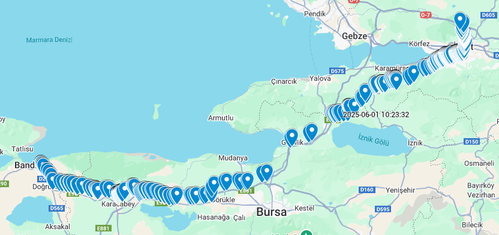

# 🚚 GPS Trajectory Simulator with Realistic Timing and Noise

This project simulates GPS route data between an origin and destination using **real road network data** from OpenStreetMap (OSM). It incorporates **realistic timing** based on road types, traffic patterns, and junction delays. Additionally, it can generate **noisy GPS tracks** to simulate sensor inaccuracy.

---

## 🧠 Features

- Realistic routing using OSM road network  
- Speed estimation based on road type and urban context  
- Time-of-day traffic modifiers (rush hour effects)  
- Random delays at intersections (junctions)  
- Timestamp generation for each GPS point  
- Optional GPS noise injection to simulate real-world GPS drift  

---

## 📦 Requirements

Install Python dependencies with:

```bash
pip install osmnx networkx pandas numpy geopy
```

---

## 🚀 Usage

Run the simulation script:

```bash
python gps_simulation.py
```

This will generate two CSV files:

- `reference_route.csv`: Clean, timestamped GPS data  
- `noisy_route.csv`: Same route with added positional noise  

---

## 📁 Project Structure

| File / Folder          | Description                                     |
|------------------------|-------------------------------------------------|
| `main.py`              | Main script for generating the GPS data         |
| `reference_route.csv`  | Clean, time-based GPS route                     |
| `noisy_route.csv`      | Noisy GPS data simulating sensor drift          |
| `images/`              | Folder to store generated map images            |
| `README.md`            | Project documentation                           |

---

## ⚙️ Configuration

The following aspects can be adjusted inside the script:

| Parameter              | Description                                      |
|------------------------|--------------------------------------------------|
| `SPEED_BY_HIGHWAY`     | Default speeds (km/h) for each highway type      |
| `traffic_modifier()`   | Adjusts speed based on time of day               |
| `is_junction()`        | Adds extra delay when approaching intersections  |
| `add_gps_noise()`      | Adds positional noise (radius in meters)         |

---

## 📍 Example Coordinates Used

```python
origin_coords = (40.3233635,28.0000311)         
destination_coords = (40.825069,29.9252826)
```

You can replace these with any coordinates globally.

---


## 🖼 Example Output

<p align="center">
  
</p>


---

## 🕒 Performance Note

When simulating long routes or wide areas (e.g., across cities), you may see a warning like this:

```
UserWarning: This area is 16 times your configured Overpass max query area size...
```

This means OSMnx is automatically splitting the request into smaller sub-queries, which **can take several minutes** depending on internet speed and the Overpass server's load. Be patient — the result is cached locally for faster future runs.

To avoid pushing large temporary files, add the following to your `.gitignore`:

```
__pycache__/
.osmnx_cache/
```

---

## 🧪 Use Cases

- Simulating vehicle movement for testing GPS systems  
- Generating synthetic data for machine learning models  
- Route anomaly detection development  
- Academic research in transportation or logistics  

---

## 🤝 Contributing

Feel free to open issues or submit pull requests for improvements or new features.
